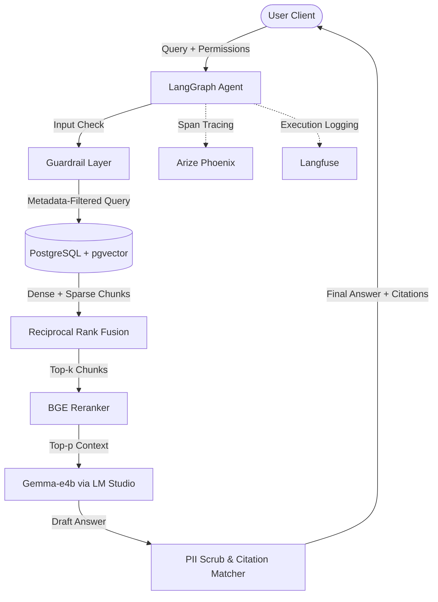

# System Design: Production-Grade RAG with Local Gemma (LM Studio)

This document outlines the end-to-end system design for a compliance-aware, production-ready retrieval-augmented generation (RAG) system operating on a regulated insurance policy corpus.

---

## 1. Problem Validation
- **Context**: Enterprises operating in regulated sectors (e.g., insurance, legal, healthcare) require search and synthesis capabilities over corporate policies and regulatory filings.
- **Problem**: 
  - **Compliance Risk**: Post-retrieval LLM filtering fails under adversarial prompts, causing cross-jurisdictional and cross-role leakage.
  - **Accuracy Deficit**: Regulated queries demand precise citations mapped directly to source text anchors.
  - **Resource Control**: Hosting commercial models violates data residency rules and results in unpredictable API costs.
- **Scope**: Deploy a 100% local, role- and jurisdiction-aware RAG pipeline using a locally hosted Gemma-e4b model (LM Studio) and a local PostgreSQL vector store.

---

## 2. Assumptions & Challenges
- **Assumption 1**: The user's machine running LM Studio has a GPU capable of low-latency inference on the `gemma-e4b` model.
  - *Challenge*: SentenceTransformers (embeddings + reranker) and PostgreSQL will compete for the same GPU/CPU resources.
  - *Mitigation*: Configure separate memory footprints, batch size constraints, and device assignments (e.g., CUDA for LLM, CPU for embeddings/reranking if VRAM is constrained).
- **Assumption 2**: Document role/jurisdiction tags are reliably mapped at ingestion.
  - *Challenge*: Loose tags lead to leakage.
  - *Mitigation*: Enforce database-level schema constraints that make role and jurisdiction fields non-nullable.

---

## 3. Functional Requirements
- **FR-1**: Role-based access control (RBAC) and Jurisdiction-based access control (JBAC) enforced *pre-retrieval*.
- **FR-2**: Synthesized answers must contain verifiable markdown citations linking to source text snippets.
- **FR-3**: Automated input and output safety guardrails (Llama Guard / safety filters).
- **FR-4**: Automatic PII scrubbing on synthesis outputs.

---

## 4. Non-Functional Requirements
- **NFR-1 (Security)**: Zero cross-jurisdiction or cross-role leakages.
- **NFR-2 (Latency)**: p95 end-to-end latency <= 3.5 seconds.
- **NFR-3 (Availability/Consistency)**: Strong write-consistency for the document catalog, eventual consistency for vector search indices.
- **NFR-4 (Observability)**: Complete trace collection (inputs, spans, metrics) via local Langfuse and Arize Phoenix.

---

## 5. High-Level Architecture



---

## 6. Major Components Deep-Dive
- **Ingestion Pipeline**: Reads raw files (PDFs, HTML), chunks them semantically using sliding windows, generates Nomic embeddings, and writes to pgvector.
- **Hybrid Retrieval & RRF**: Queries pgvector (dense) and a Tantivy index (sparse BM25) concurrently, combining rankings using Reciprocal Rank Fusion (RRF).
- **LangGraph Orchestrator**: Manages state transitions between retrieval, reranking, safety guardrails, and final generation.
- **Local Inference Server**: LM Studio hosting `gemma-e4b`, exposing an OpenAI-compatible `/v1/chat/completions` API.

---

## 7. Data Models & Schemas

### PostgreSQL Schema
```sql
CREATE EXTENSION IF NOT EXISTS vector;

CREATE TABLE IF NOT EXISTS documents (
    id UUID PRIMARY KEY DEFAULT gen_random_uuid(),
    title VARCHAR(255) NOT NULL,
    source_url TEXT,
    created_at TIMESTAMP WITH TIME ZONE DEFAULT CURRENT_TIMESTAMP
);

CREATE TABLE IF NOT EXISTS document_chunks (
    id UUID PRIMARY KEY DEFAULT gen_random_uuid(),
    document_id UUID REFERENCES documents(id) ON DELETE CASCADE,
    content TEXT NOT NULL,
    embedding vector(768) NOT NULL, -- Nomic Embed size
    allowed_roles VARCHAR(50)[] NOT NULL,
    allowed_jurisdictions VARCHAR(50)[] NOT NULL,
    chunk_index INT NOT NULL,
    page_number INT
);

CREATE INDEX IF NOT EXISTS chunk_hnsw_idx ON document_chunks 
USING hnsw (embedding vector_cosine_ops) WITH (m = 16, ef_construction = 64);

CREATE INDEX IF NOT EXISTS chunk_roles_idx ON document_chunks USING gin (allowed_roles);
CREATE INDEX IF NOT EXISTS chunk_jurisdictions_idx ON document_chunks USING gin (allowed_jurisdictions);
```

---

## 8. APIs & Contracts

### Ingestion Contract
```json
{
  "document_title": "Texas Homeowners Policy",
  "source_url": "s3://policies/tx_homeowners.pdf",
  "chunks": [
    {
      "content": "Section A: Liability coverage is limited to...",
      "allowed_roles": ["agent", "underwriter"],
      "allowed_jurisdictions": ["US-TX"],
      "page_number": 12
    }
  ]
}
```

### Retrieval Query API
```python
def retrieve_chunks(
    query: str, 
    user_roles: list[str], 
    user_jurisdictions: list[str], 
    limit: int = 5
) -> list[dict]:
    """Retrieves document chunks matching user role and jurisdiction access constraints."""
    ...
```

---

## 9. Data Flow & Control Flow
1. User requests: *"What are the water damage limits in Texas?"* with user attributes `roles=["agent"]`, `jurisdictions=["US-TX"]`.
2. Input Guardrail validates prompt for injection or policy violations.
3. Database executes a pgvector Cosine similarity query combined with Tantivy BM25.
   - **Crucial Constraint**: The query filter contains `allowed_roles && :user_roles` AND `allowed_jurisdictions && :user_jurisdictions`.
4. RRF ranks the combined results.
5. Local BGE Reranker selects top-3 chunks.
6. Local Gemma model synthesizes response based on provided context.
7. Post-Filter scrubs PII and checks citation anchors.
8. Output delivered to client.

---

## 10. Scaling Strategy
- **Vector Search**: Use `pgvectorscale` or partition the `document_chunks` table by jurisdiction to limit index scan scope.
- **Sparse Indexing**: Build Tantivy indexes per jurisdiction for parallelized, isolated search executions.
- **Inference Concurrency**: Deploy multiple instances of LM Studio behind a local load balancer (e.g. Nginx) if throughput needs to scale.

---

## 11. Failure Scenarios & Recovery
- **LM Studio Crash**: The agent catches ConnectionError and falls back to a graceful refusal message indicating the synthesis service is temporarily offline.
- **Database Connection Loss**: Retries connection up to 3 times with exponential backoff before throwing a structured database error.
- **Incomplete Chunk Citations**: If Gemma fabricates a citation or fails to cite, the post-filter reruns synthesis with a strict formatting warning or defaults to raw search results.

---

## 12. Deployment & Rollback
- **Infrastructure**: Managed via a single `docker-compose.yml` defining PostgreSQL, Tantivy server, Arize Phoenix, and Langfuse.
- **Rollback**: To rollback database schema changes, run migration downgrade scripts (`alembic downgrade -1` or raw SQL scripts).

---

## 13. Testing Strategy
- **Integration Tests**: Verify database metadata filtering. Retrieve document chunks with guest credentials and assert admin documents are not returned.
- **Regression Suite**: Run the 200-question golden set through `evals/run_evals.py` on every major update.
- **Security Testing**: Execute the 50-prompt red-team jailbreak scenarios.

---

## 14. Observability & Alerting
- **Tracing**: Langfuse records exact spans for Rerank, Retrieval, Guardrails, and Synthesize steps.
- **Drift Dashboard**: Arize Phoenix weekly telemetry computes semantic similarity drift between user queries and index embeddings.

---

## 15. Risks & Mitigations
- **Risk**: Local system out of VRAM due to `gemma-e4b` + sentence-transformers running on the same GPU.
- **Mitigation**: Run sentence-transformers on CPU (`device="cpu"`) since text embedding and reranking calculations are small, reserving VRAM entirely for the LLM running on LM Studio.

---

## 16. Justify Tradeoffs
- **Why Tantivy over Elasticsearch?**
  - Elasticsearch adds substantial JVM overhead and operational complexity. Tantivy is a Rust-based, highly efficient, dependency-free alternative that runs locally with minimal RAM footprint.
- **Why Pre-Retrieval Gin Indexes over LLM post-filtering?**
  - LLM post-filtering is non-deterministic, slow, expensive, and insecure. Pre-retrieval filtering at the database layer is mathematically secure and highly efficient.
